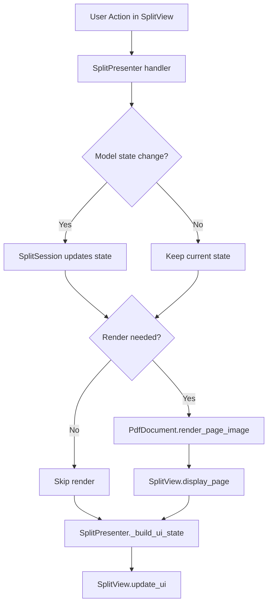
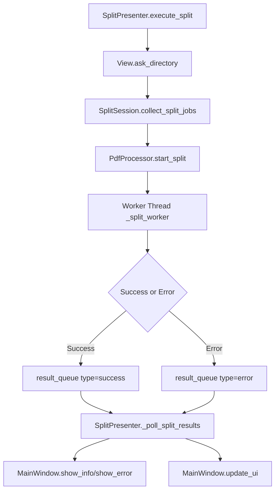
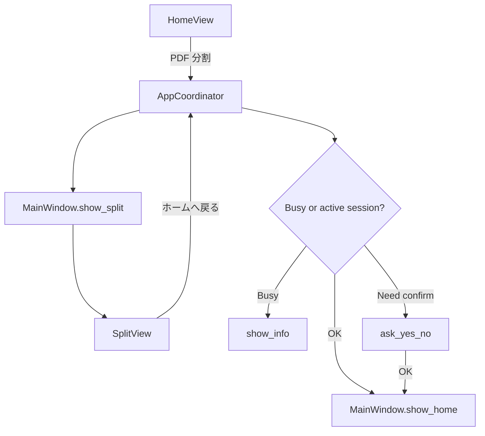

# 開発者向け設計ドキュメント

このアプリはMVP（Model / View / Presenter）で構成されています。

---

## 0. 目的

この文書の目的は、次の3点を明確にすることです。

- どの層に何を置くか（責務境界）
- 変更時にどこへ影響が波及するか（依存関係）
- どの順番で改修すると安全か（実装フロー）

## 1. 全体構成

- エントリーポイント: `main.py`
  - `MainWindow` を生成
  - 起動時スプラッシュを表示（`view/startup_splash.py`）
  - `AppCoordinator` を生成し、`SplitPresenter` を注入
  - `mainloop()` 開始
- Presenter:
  - `presenter/app_coordinator.py`（画面遷移、機能選択、Presenter ライフサイクル管理）
  - `presenter/split_presenter.py`（分割機能のユースケースを担当）
- Model:
  - `model/pdf_document.py`（PDFの読み込み/レンダリング）
  - `model/split/split_session.py`（分割状態/セクション状態）
  - `model/split/pdf_processor.py`（非同期分割処理）
- View:
  - `view/main_window.py`（トップレベル、`QStackedWidget`、ダイアログ）
  - `view/home_view.py`（ホーム画面）
  - `view/startup_splash.py`（起動時スプラッシュ表示）
  - `view/split/split_view.py`（分割画面、`UiState`）
  - `view/split/components/*.py`（分割画面のウィジェット群）

### 1.1 依存の向き

- `main.py` → View / Presenter を組み立てる
- Presenter → Model と View に依存
- Viewコンポーネント → Presenterにイベント委譲
- Model → 外部ライブラリ（PyMuPDF, PIL）へ依存可能だが、Viewには依存しない

### 1.2 プロジェクトツリー

```text
pdf_manipulator/
├─ main.py
├─ PDFSplitter.spec
├─ pyproject.toml
├─ docs/
│  ├─ user-manual.md
│  ├─ keyboard-shortcuts.md
│  └─ developer-architecture.md
├─ model/
│  ├─ pdf_document.py
│  └─ split/
│     ├─ pdf_processor.py
│     └─ split_session.py
├─ presenter/
│  ├─ app_coordinator.py
│  └─ split_presenter.py
└─ view/
  ├─ home_view.py
  ├─ main_window.py
  ├─ startup_splash.py
  └─ split/
    ├─ split_view.py
    └─ components/
      ├─ controls.py
      ├─ preview.py
      └─ split_bar.py
```

## 2. 責務分離ルール

### Presenter (`SplitPresenter` / `AppCoordinator`)

- View公開メソッドのみを呼ぶ
- UIウィジェットの具体API（Tk/CTk）を直接触らない
- Modelから`UiState`を生成し`update_ui()`で反映
- `AppCoordinator` はホーム画面の選択と画面切り替えを管理する

代表的な公開ハンドラ:

- ドキュメント: `open_pdf()`, `on_closing()`
- ナビゲーション: `prev_page()`, `next_page()`, `go_to_page()`
- 分割点: `add_split_point()`, `remove_split_point()`
- 実行: `execute_split()`

### Model

- UIに依存しない純粋ロジック
- `SplitSession` は状態遷移と入力値整形を担当
- `PdfProcessor` はスレッド＋キューで非同期保存を担当

注意点:

- `SplitSession` はファイル名サニタイズ規約を保持するため、命名仕様変更はここを起点に行う
- `PdfDocument` はレンダリングキャッシュを持つため、表示異常調査時は `cache_key` の仕様確認が有効

### View

- イベントをPresenterへ委譲
- `UiState` を受けて表示更新
- ファイルダイアログ/メッセージボックスを提供

注意点:

- View層で業務ルール（分割可否など）を判定しない
- View内のイベントハンドラは、可能な限りPresenter呼び出し＋`break`返却に限定する

## 3. 主要データ

### `UiState`（`view/split/split_view.py`）

PresenterからViewへ渡す表示状態DTO。

- ページ情報（`page_info_text`, `zoom_info_text`）
- 分割バー情報（総ページ、現在ページ、分割点、アクティブセクション）
- セクション表示情報（範囲、色、ファイル名）
- 操作可能フラグ（ボタン有効/無効）

運用ルール:

- 表示に必要な情報は `UiState` に集約し、個別ウィジェットがModelを直接参照しない
- 新しい表示要素を追加する場合は、`UiState` → `SplitPresenter._build_ui_state()` → `SplitView.update_ui()` の順で拡張する

### `sections_data`（`SplitSession`）

各セクションを辞書で保持。

- `start`, `end`
- `filename`
- `is_custom_name`

期待する不変条件:

- `start <= end`
- セクションはページ範囲を重複なく連続で覆う
- `split_points` 変更後は必ず `_rebuild_sections_data()` で再構築される

### 3.1 分割ジョブ構造

`collect_split_jobs()` の戻り値要素:

- `index`: 1始まりの連番
- `start`: 開始ページ（0始まり）
- `end`: 終了ページ（0始まり）
- `filename`: 出力ファイル名（`.pdf` 付き）

## 4. 主要フロー

### 4.1 UIイベント → 再描画フロー



対応メソッド例:

- ページ移動: `prev_page()`, `next_page()`, `go_to_page()`
- 分割点操作: `add_split_point()`, `remove_split_point()`
- 描画更新: `_render_and_refresh()`

実装上のポイント:

- ページ遷移やズーム変更時のみレンダリングを行う
- 分割点だけ変わる操作では `_refresh_ui()` のみで済ませる

### 4.2 分割実行（非同期）フロー



補足:

- `SplitPresenter` が `schedule(100, _poll_split_results)` でポーリング
- 実行中フラグは `PdfProcessor.is_splitting`

### 4.4 画面遷移フロー



実装上のポイント:

- `start_split()` 呼び出し前に古いキュー結果を破棄する
- 失敗時は `type=error` のメッセージを優先してUIへ返す
- 完了時は `type=success` と作成ファイル数を通知する

### 4.3 終了処理フロー

1. 分割中なら確認ダイアログを表示
2. ポーリングジョブがあれば `after_cancel`
3. `PdfDocument.close()`
4. View破棄

この順序を崩すと、終了間際のコールバックで例外が出る可能性があります。

## 5. キーバインド責務

- プレビュー上キー: `view/split/components/preview.py`
- ファイル名入力欄キー: `view/split/components/controls.py`（`SectionPanel`）
- 全体キー: `view/main_window.py` の `QShortcut`

実装を変更した場合は、`docs/keyboard-shortcuts.md` も更新してください。

### 5.1 変更時のチェック観点

- 同じキーが複数層で競合していないか
- `Shift` 判定分岐（`event.state`）が期待どおりか
- テンキー `KP_Enter` の対応漏れがないか

## 6. 拡張時の指針

- 新しい機能はまず各機能 Presenter のユースケース単位で追加
- 状態が増える場合は `SplitSession` / `UiState` に明示的に反映
- 非同期処理を増やす場合は `PdfProcessor` に閉じ込め、Viewに直接スレッドを持ち込まない
- Viewコンポーネントは表示責務に限定し、業務ロジックを置かない

### 6.1 典型的な改修手順

1. ユースケースをPresenterのメソッドとして定義
2. 必要な状態をModelへ追加
3. `UiState` に表示項目を追加
4. Viewコンポーネントを最小変更で更新
5. ドキュメント（本書 + user-manual + keyboard-shortcuts）を同期

### 6.2 改修時のアンチパターン

- View側に `if split_points ...` のような業務判定を増やす
- PresenterからTkウィジェットへ直接アクセスする
- Modelからメッセージボックス表示を呼ぶ

## 7. ドキュメント保守ポイント

- Viewイベント追加・キー追加時: `docs/keyboard-shortcuts.md` を更新
- 分割処理の手順やエラー仕様変更時: `docs/user-manual.md` を更新
- 層責務・フロー変更時: 本ドキュメントのMermaid図を更新

---

将来、バッチ処理やCLIを追加する場合も、Presenterをユースケース境界として維持すると段階移行が容易です。
