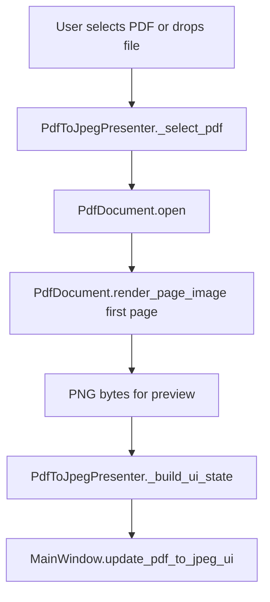
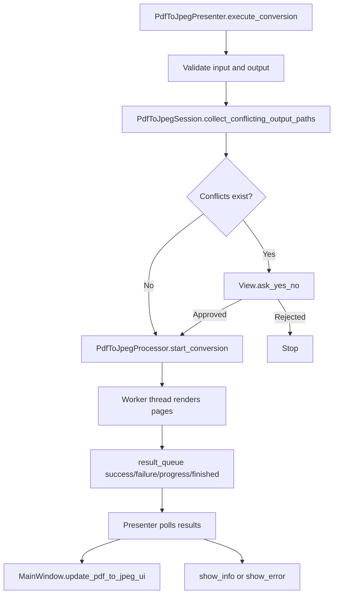
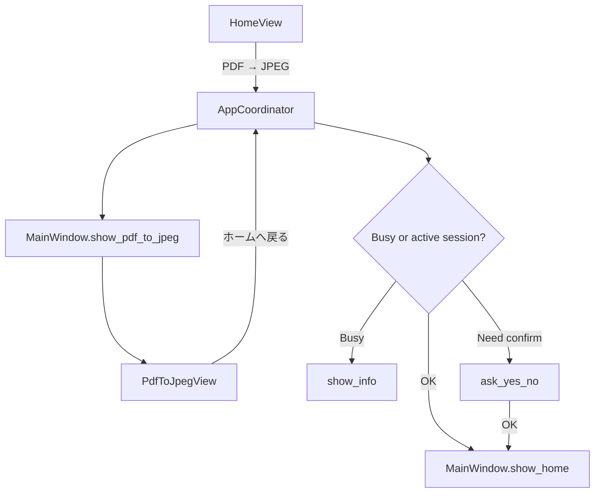

# 開発者向け設計ドキュメント

このアプリは PySide6 ベースのデスクトップアプリで、MVP（Model / View / Presenter）で構成されています。

---

## 0. 目的

この文書の目的は、次の3点を明確にすることです。

- どの層に何を置くか（責務境界）
- 変更時にどこへ影響が波及するか（依存関係）
- どの順番で改修すると安全か（実装フロー）

## 1. 全体構成

- エントリーポイント: `main.py`
  - `MainWindow` を生成
  - 起動時スプラッシュを表示（`view/startup_splash.py`）
  - `AppCoordinator` を生成して各 Presenter を組み立てる
  - Qt イベントループを開始
- Presenter:
  - `presenter/app_coordinator.py`（画面遷移、ホーム選択、終了制御）
  - `presenter/split_presenter.py`
  - `presenter/merge_presenter.py`
  - `presenter/compress_presenter.py`
  - `presenter/pdf_to_jpeg_presenter.py`
- Model:
  - `model/pdf_document.py`（プレビュー用 PDF 読み込み / レンダリング）
  - `model/split/*`
  - `model/merge/*`
  - `model/compress/*`
  - `model/pdf_to_jpeg/*`
- View:
  - `view/main_window.py`（トップレベル、`QStackedWidget`、ダイアログ、タイマー）
  - `view/home_view.py`（ホーム画面）
  - `view/startup_splash.py`
  - `view/split/*`
  - `view/merge/*`
  - `view/compress/*`
  - `view/pdf_to_jpeg/*`

### 1.1 依存の向き

- `main.py` → View / Presenter を組み立てる
- Presenter → Model と View に依存
- Viewコンポーネント → Presenter にイベント委譲
- Model → 外部ライブラリ（PyMuPDF, PIL, pikepdf）へ依存可能だが、Viewには依存しない

### 1.2 プロジェクトツリー（主要部）

```text
pdf_toobox/
├─ main.py
├─ pyproject.toml
├─ docs/
│  ├─ user-manual.md
│  ├─ keyboard-shortcuts.md
│  └─ developer-architecture.md
├─ model/
│  ├─ pdf_document.py
│  ├─ split/
│  ├─ merge/
│  ├─ compress/
│  └─ pdf_to_jpeg/
├─ presenter/
│  ├─ app_coordinator.py
│  ├─ split_presenter.py
│  ├─ merge_presenter.py
│  ├─ compress_presenter.py
│  └─ pdf_to_jpeg_presenter.py
└─ view/
   ├─ home_view.py
   ├─ main_window.py
   ├─ startup_splash.py
   ├─ split/
   ├─ merge/
   ├─ compress/
   └─ pdf_to_jpeg/
```

## 2. 責務分離ルール

### Presenter

- View の公開メソッドだけを呼ぶ
- Qt ウィジェットの詳細 API に直接依存しない
- Model と実行状態から `UiState` を組み立てて `update_*_ui()` で反映する
- バックグラウンド処理の結果はポーリングで受け取る

### Model

- UI に依存しない純粋ロジック
- Session は機能ごとの状態、入力整形、実行可否、命名規則を保持する
- Processor はスレッド＋キューで非同期 I/O を担当する

### View

- イベントを Presenter へ委譲する
- `UiState` を受けて表示更新する
- ファイルダイアログ、メッセージボックス、`schedule()` を提供する

運用上の共通ルール:

- 業務ルールは View に書かない
- 非同期処理は Processor に閉じ込め、View に直接スレッドを持ち込まない
- 画面遷移と終了時の共通ルールは `AppCoordinator` に寄せる

## 3. PDF→JPEG 機能の責務

### 3.1 Model

#### `model/pdf_to_jpeg/pdf_to_jpeg_session.py`

- 入力PDFパス、保存先フォルダ、JPEG品質を保持
- 出力サブフォルダ名を `PDF名` から決定
- `PDF名_001.jpg` 形式のファイル名を生成
- 実行前の競合候補一覧を収集
- 進捗状態を `total_pages`, `processed_pages`, `current_page_number` で保持

#### `model/pdf_to_jpeg/pdf_to_jpeg_processor.py`

- PyMuPDF で各ページを専用の書き出し経路でレンダリング
- 透明要素を含むページは RGBA → 白背景 RGB に合成してから JPEG 保存
- `success` / `failure` / `progress` / `finished` をキューへ積む
- 実行前の競合検出結果を見て、未承認の上書きを拒否する

### 3.2 Preview 基盤

`model/pdf_document.py` はプレビュー専用に使う。

- `PdfToJpegPresenter` は先頭ページプレビューとページ数取得にだけ再利用する
- JPEG書き出し自体は `frame_width` / `zoom` ベース API に寄せず、`PdfToJpegProcessor` の専用レンダリングで行う

この分離により、プレビュー都合の縮尺ロジックが出力品質へ混ざらない。

### 3.3 Presenter

`presenter/pdf_to_jpeg_presenter.py` の責務:

- 単一PDF入力の検証
- `PdfDocument` を使った先頭ページプレビュー生成
- 保存先選択と品質変更の反映
- 実行前の競合確認ダイアログ表示
- Processor 結果のポーリング
- 完了通知と終了確認

### 3.4 View

`view/pdf_to_jpeg/pdf_to_jpeg_view.py` の責務:

- ヘッダー、単一PDF入力、プレビュー、品質スライダー、注記、保存先、進捗欄の構築
- `PdfToJpegUiState` による一括更新
- PDF ドロップ受付
- プレビュー領域サイズの提供

## 4. 主要データ

### `PdfToJpegUiState`

Presenter から View へ渡す表示状態 DTO。

- 入力PDF表示 (`selected_pdf_text`)
- 保存先表示 (`output_dir_text`, `output_detail_text`)
- 注記文言 (`note_text`)
- 進捗表示 (`progress_text`, `summary_text`, `progress_value`)
- 品質 (`jpeg_quality`)
- プレビュー (`preview_png_bytes`, `preview_text`)
- 実行可否フラグ (`can_choose_pdf`, `can_choose_output`, `can_execute` など)

### `PdfToJpegSession` の不変条件

- 入力は単一PDFのみ
- 出力ファイル名は常に `PDF名_XXX.jpg`
- 出力先は常に `保存先/PDF名/` 配下
- 実行可否は `input_pdf_path` と `output_dir` の両方が揃っていること

## 5. 主要フロー

### 5.1 PDF選択 → プレビュー更新



ポイント:

- プレビュー生成失敗時はセッション更新前にエラーを返す
- 先頭ページ以外のプレビューは初版では持たない

### 5.2 PDF→JPEG 実行フロー



ポイント:

- 上書き承認後は一括上書きとする
- Presenter は 100ms 単位で結果キューをポーリングする
- Processor はページ単位の結果と最終完了イベントを返す

### 5.3 画面遷移と終了制御



終了時の共通ルール:

- 実行中なら確認ダイアログを出す
- ポーリングジョブを停止する
- 必要なプレビューリソースを閉じる
- 最後に `destroy_window()` を呼ぶ

## 6. テストと確認観点

### 6.1 自動テスト

PDF→JPEG 追加時点で、次の粒度を持つ。

- Model テスト
  - 命名規則
  - 出力サブフォルダ決定
  - 競合候補検出
  - 品質保持
  - 白背景合成
  - キューイベント
- Presenter テスト
  - 入力不足
  - 保存先不足
  - 上書き確認
  - 上書き承認後の開始
  - 完了通知
- View テスト
  - ボタン配線
  - プレビュー表示
  - 進捗表示更新
  - 実行中の無効化
- Integration テスト
  - Home → MainWindow → AppCoordinator の導線
  - 戻る操作 / 終了制御

### 6.2 手動確認

1. ホーム画面から `PDF → JPEG` へ遷移できる
2. PDF選択で先頭ページプレビューが表示される
3. 保存先選択で `保存先/PDF名/` が表示される
4. `PDF名_001.jpg` 形式で書き出される
5. 既存JPEG競合時に確認ダイアログが出る
6. 透明背景ページが白背景JPEGになる

## 7. 拡張時の指針

- 新しい機能はまず Session / Processor / Presenter / UiState の順で責務を分ける
- 状態が増える場合は Session と UiState に明示的に追加する
- 非同期処理を増やす場合も View に直接スレッドを持ち込まない
- Home からの導線追加は `AppCoordinator` と `MainWindow` の両方を更新する

### 7.1 PDF→JPEG を拡張するときの注意

- DPI 指定を追加する場合は Session に設定値を持たせ、Processor のレンダリング倍率へつなぐ
- ページ範囲指定を追加する場合は Session に範囲解決責務を持たせる
- PNG 出力や命名テンプレート変更を追加する場合も、命名規則は Model に閉じ込める

### 7.2 アンチパターン

- View で上書き判定や実行可否を独自に判断する
- Presenter から Qt の個別ウィジェット状態を直接読む
- `PdfDocument` のプレビュー API をそのまま JPEG 書き出しへ流用する

## 8. ドキュメント保守ポイント

- UI 導線やラベル変更時: `README.md` と `docs/user-manual.md` を更新
- キー操作変更時: `docs/keyboard-shortcuts.md` を更新
- 層責務・フロー変更時: 本書の Mermaid 図を更新

---

将来、PDF→PNG やページ範囲付き書き出しを追加する場合も、Session と Processor を中心に仕様を固定してから Presenter / View を広げると破綻しにくい。
